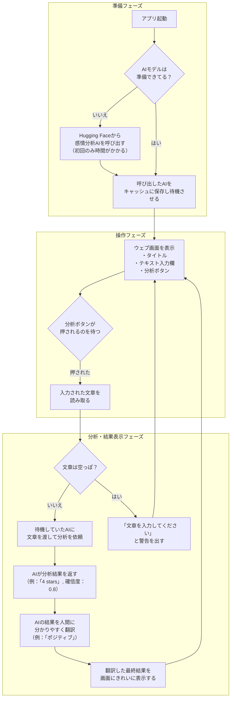

# 感情分析Webアプリ

ユーザーが入力したレビュー文を「ポジティブ」「ネガティブ」に分類するWebアプリです。

## 技術スタック

- **フレームワーク**: Streamlit
- **モデル**: HuggingFace Transformers (`nlptown/bert-base-multilingual-uncased-sentiment`)
- **言語**: Python

## ローカルでの実行方法

1. 必要なライブラリをインストールします。
   ```bash
   pip install -r requirements.txt
   ```

2. Streamlitアプリを実行します。
   ```bash
   streamlit run app.py
   ```

3. ブラウザで `http://localhost:8501` を開きます。

## 処理フロー



## デプロイ手順 (Vercel)

このStreamlitアプリはVercelにデプロイできます。

1. **GitHubリポジトリの作成**:
   - このプロジェクトをGitHubにプッシュします。

2. **Vercelプロジェクトの作成**:
   - Vercelにログインし、`Add New...` -> `Project` を選択します。
   - 作成したGitHubリポジトリをインポートします。

3. **プロジェクトの設定**:
   - **Framework Preset**: `Other` を選択します。
   - **Build and Output Settings** を以下のように設定します。
     - **Build Command**: `pip install -r requirements.txt`
     - **Start Command**: `streamlit run app.py --server.port $PORT --server.headless true`

4. **デプロイ**:
   - `Deploy` ボタンをクリックします。デプロイが完了すると、公開URLが発行されます。